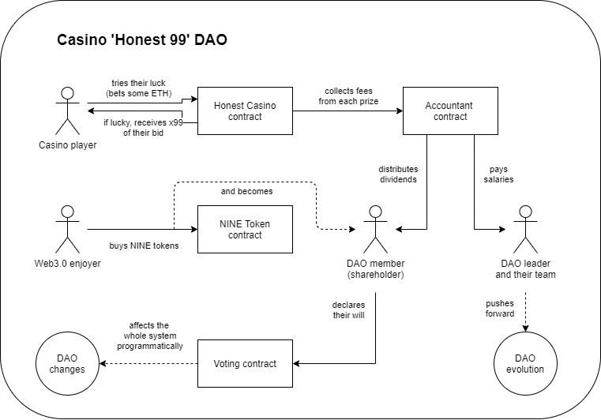

The online casino owned by its community

##### The big picture

#### Contracts

##### NINE Token

The heart of Casino 'Honest 99' DAO is `NineToken` contract which is based on a custom version of `ERC20` - 
`ERC20WithHistory`. This contract provides us with the unique feature - it is aware of history of balances of
its accounts. This enables other contracts to verify the possession of tokens by any account
at any specific moment in the past.

> this is achieved by saving history snapshots using ERC20 `_beforeTokenTransfer` hook

This feature is fundamental for the entire contract system, because it enables us to securely implement cheap (in terms
of gas) dividends distribution system and cheap voting system both based on amounts of capital possessed by the 
account. 

##### Accountant

`Accountant` contract uses balance history feature to implement dividend distribution sessions. Shareholders
(DAO members) are calling its `receiveDividends()` method and receive ETH (fees collected from the casino)
based on their share at the moment of the beginning of the distribution session.

> For example: 
>
> You had `100 Nines` at the 1st of January. During December `500 ETH fees` were collected from the casino.
> Your dividends would amount `500 / 10_000 * 100 = 5 ETH`.

You don't need to lock your NINE tokens or commit any explicit proofs - the contract knows for sure how much shares you 
had for current dividend distribution session.

##### Honest Casino

// TODO: add links to Medium articles

##### Voting

This contract makes our DAO special. Just like Accountant contract, Voting also uses balance history feature from `ERC20WithHistory`
the same exact way - when some voting starts, and you vote, it will check your balance at the moment when the voting did start.

This contract provides us a way to democratically evolve the whole system when it needs changes.

### Development

[figma link](https://www.figma.com/file/YaSFWfbMo4Ey5U1ytbrPZq/Honest-Casino?node-id=0%3A1)

This project consists of the next modules:
1. Solidity contracts inside `contracts` dir
2. Mocha-ts tests under `test` dir
3. Preact frontend in `src`

### Run tests

* make sure you're running `node 10`
* `yarn install`
* `yarn compile`
* make sure your docker service is running
* `./start-ganache.sh` or `start-ganache.bat`
* `yarn test`

### Contributing

Feel free to open an issue.